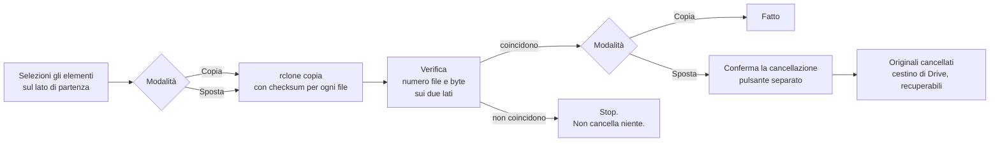

<div align="center">


# DriveFerry

**Sposta file e cartelle da un account Google Drive a un altro, vedendo cosa succede.**
Un'app desktop nativa costruita su rclone, per l'unica cosa che Google Drive ancora non fa.

[](https://github.com/rlpb/driveferry/actions/workflows/ci.yml)
[](https://github.com/rlpb/driveferry/releases/latest)
[](LICENSE)
[](pyproject.toml)
[](#scarica)
[](https://ko-fi.com/rlpb_)

[Scarica](#scarica) · [Come funziona](#come-funziona-un-trasferimento) · [Sicurezza](#sicurezza-dei-dati) · [Domande](#domande-frequenti) · [English](README.md)

</div>

---

## Il problema

Google Drive non ha un comando "sposta questa cartella sull'altro mio account".
Puoi condividere una cartella e, in certi casi, trasferirne la proprietà, ma non
esiste un'azione unica che sposti un intero albero da un account Google a un
altro. Fra due account Gmail personali il trasferimento di proprietà di una
cartella non porta con sé i file che contiene. Fra organizzazioni Workspace
diverse è spesso bloccato del tutto.

Le alternative abituali sono scaricare tutto e ricaricarlo, oppure imparare la
riga di comando di rclone.

DriveFerry è la terza strada: vedi i due account affiancati, selezioni cosa
spostare e premi un pulsante.

<div align="center">

</div>

## Cosa fa

- **Colleghi gli account senza terminale.** Una procedura guidata ti porta
  fino in fondo e lascia l'accesso alla pagina di Google. La password non si
  digita mai dentro DriveFerry.
- **Due account affiancati.** Sfogli entrambi i Drive insieme, entri nelle
  cartelle, selezioni più elementi, trascini da un lato all'altro.
- **Copia che puoi guardare.** Avanzamento, velocità e stima del tempo residuo
  presi dalle statistiche di rclone.
- **Spostamento che non può mangiarti i dati.** Lo spostamento è in tre passi:
  copia, verifica che ogni file sia arrivato, e solo dopo cancella gli
  originali, con una conferma separata che devi premere tu.
- **Confronto, quando vuoi.** Seleziona gli stessi nomi sui due lati e premi
  Confronta: numero di file e byte totali, affiancati, in sola lettura. La
  risposta a "è arrivato davvero tutto" senza aprire Drive nel browser e
  contare a occhio.
- **Verifica prima della cancellazione.** Numero di file e byte totali
  confrontati sui due lati. Se non coincidono, la cancellazione non viene
  offerta.
- **Simulazione.** Chiedi a rclone cosa trasferirebbe, senza scrivere niente.
- **Copia lato server.** Quando Google la consente fra i tuoi due account, i
  byte non passano dal tuo computer né dalla tua connessione.
- **Una finestra vera.** Senza cornice, con la barra del titolo disegnata
  dall'app, uguale su Windows, macOS e Linux.
- **Tema chiaro e scuro.** Segue il sistema oppure lo fissi nelle impostazioni.
- **Italiano e inglese.** Segue il sistema oppure lo fissi nelle impostazioni.
- **Qualsiasi remote di rclone, non solo Drive.** Dropbox, OneDrive, S3, una
  cartella locale: se rclone ci parla, i due pannelli lo mostrano.

<div align="center">

</div>

## Scarica

Prendi il file per il tuo sistema dalla
[release più recente](https://github.com/rlpb/driveferry/releases/latest):

| Sistema | File | Note |
| --- | --- | --- |
| Windows 10/11 | `DriveFerry-windows-x64.exe` | Usa il runtime WebView2, già presente su Windows 11 |
| macOS, Apple Silicon | `DriveFerry-macos-arm64.zip` | Non firmata: al primo avvio tasto destro e **Apri** |
| Linux x64 | `DriveFerry-linux-x64` | Richiede `gir1.2-webkit2-4.0` e `python3-gi` |
| macOS, Intel | `DriveFerry-macos-x64.zip` | Non firmata: al primo avvio tasto destro e **Apri** |

Ogni release porta un `SHA256SUMS.txt` prodotto dallo stesso workflow che ha
costruito i binari, così puoi verificare che il file scaricato sia quello che la
CI ha creato:

```bash
sha256sum -c SHA256SUMS.txt --ignore-missing
```

Serve rclone sulla macchina. Se manca, l'app te lo dice e ti dà il comando:

| Sistema | Comando |
| --- | --- |
| Windows | `winget install --id Rclone.Rclone` |
| macOS | `brew install rclone` |
| Linux | `sudo -v ; curl https://rclone.org/install.sh \| sudo bash` |

### Oppure dal sorgente

```bash
git clone https://github.com/rlpb/driveferry
cd driveferry
python -m venv .venv && .venv\Scripts\activate
pip install -e .
python -m driveferry
```

Su Windows c'è anche `start.cmd`: doppio clic e il primo avvio prepara tutto da
solo.

## Collega gli account

Premi **Collega un account**, dai un nome che riconosci e premi **Accedi con
Google**. Si apre la pagina di consenso di Google nel browser, autorizzi, e
l'app si riempie da sola. Ripeti per il secondo account.

La password non si digita mai dentro DriveFerry: a chiederla è la pagina di
Google.

<div align="center">

</div>

<details>
<summary>Usare un client ID Google tuo</summary>

L'accesso passa dal client Google condiviso di rclone, lo stesso per tutti gli
utenti rclone del mondo. Due motivi per sostituirlo con uno tuo, da **Usa un
client ID Google mio** nella procedura:

- le migrazioni grandi possono sbattere contro il limite di richieste di Google
- rclone dichiara che quel client condiviso verrà dismesso nel corso del 2026

È gratis e richiede circa dieci minuti, e l'app ti accompagna: cinque passi,
ognuno con il pulsante che apre esattamente la pagina Google di quel passo.
Impostazioni, poi **Client ID Google**.

<div align="center">

</div>

Lo configuri una volta e tutti gli account che colleghi da lì in poi lo usano,
su questo computer e su qualsiasi altro.

</details>

> Preferisci il terminale, o vuoi collegare qualcosa che non sia Drive?
> `rclone config` funziona ancora, e ogni remote creato così compare in
> DriveFerry.

## Come funziona un trasferimento



Sotto il cofano DriveFerry misura tutto il lavoro in background mentre il primo
elemento si sta già muovendo, poi trasferisce un elemento alla volta:
`sync/copy` per una cartella, `operations/copyfile` per un singolo file, tutto
sotto un unico gruppo di statistiche. Un job alla volta è ciò che tiene fermo
il totale della barra e lascia a Google un solo flusso da rallentare invece di
venti. L'avanzamento arriva da `core/stats`, l'esito di ogni job da
`job/status`, la verifica da `operations/size` sui due lati.

## Sicurezza dei dati

Una regola sola: **non si cancella niente che non sia stato prima verificato**,
e mai senza che tu prema un secondo pulsante.

- La copia è la modalità predefinita e non tocca mai l'origine.
- Lo spostamento non usa mai il `move` di rclone. Copia, verifica e chiede.
- Il passo di cancellazione viene rifiutato dal backend se la richiesta non
  porta un valore di conferma esplicito, che l'interfaccia invia solo dopo una
  verifica riuscita.
- Gli elementi cancellati finiscono nel cestino di Google Drive, dove restano
  30 giorni.
- La simulazione è a un interruttore di distanza, in qualsiasi momento.
- I percorsi che contengono `..` vengono rifiutati e i nomi dei remote sono
  confrontati con quelli che hai davvero configurato.

## Copia lato server

Con l'interruttore **Lato server** attivo, DriveFerry chiede a rclone
`--server-side-across-configs`. Quando Google accetta, la copia avviene dentro
l'infrastruttura di Google: niente download, niente upload, la tua velocità di
connessione smette di contare.

È spenta di default, perché Google la concede solo se l'account di destinazione
può già leggere il file di origine. In pratica: la cartella di origine è
condivisa con l'account di destinazione, oppure i due account appartengono alla
stessa organizzazione Workspace.

Quando Google rifiuta, **non ripiega**. La richiesta di copia porta le
credenziali dell'account di destinazione, quindi Google risponde che il file di
origine non esiste:

```
googleapi: Error 404: File not found: 1B1W2ACFT_CtbMSqP3gPUOxX4eVei2szO., notFound
```

DriveFerry riconosce quella risposta e propone di rifare il trasferimento senza
copia lato server, che passa dal tuo computer e funziona fra due account
qualsiasi. Quello che è già arrivato resta, quindi il nuovo tentativo sposta
solo ciò che manca.

Fra due account Gmail personali scollegati, lascia l'interruttore spento.
Condividere prima la cartella di origine con l'account di destinazione è ciò
che rende possibile la copia lato server.

## Cosa DriveFerry non è

- Non è uno strumento di sincronizzazione: niente mirroring continuo, niente
  gestione dei conflitti.
- Non tocca la proprietà dei file. La copia appartiene all'account di
  destinazione, che di solito è esattamente quello che serve quando stai
  lasciando un account.
- Non è un prodotto di backup: sposta quello che selezioni, quando lo chiedi.

## Domande frequenti

**Cosa succede se copio qualcosa che c'è già?**
Viene sostituito, senza chiedere niente e senza che nasca una seconda copia
accanto alla prima. I file identici sui due lati vengono saltati invece di
essere caricati di nuovo: per questo un trasferimento interrotto si può
semplicemente far ripartire, riprende da dove si era fermato invece di
ricominciare da zero. Il riepilogo prima della copia dice quanti degli elementi
selezionati sono già a destinazione.

**Perché navigare in un Drive è lento?**
Ogni cartella aperta per la prima volta è un giro di andata e ritorno fino a
Google, e non c'è modo di evitarlo. DriveFerry tiene ogni elenco per 90
secondi, quindi tornare indietro nell'albero è istantaneo, e butta via l'elenco
di un drive appena ci scrive sopra. Il tasto aggiorna richiede sempre l'elenco
a Google.

**Che fine fanno Documenti, Fogli e Presentazioni Google?**
Non sono file veri dentro Drive, quindi non si possono copiare byte per byte.
rclone li esporta, per impostazione predefinita in formati Microsoft Office, e
la copia è un file normale. Se ti servono nativi, usa la condivisione e il
trasferimento di proprietà di Drive per quelli e DriveFerry per tutto il resto.

**Le scorciatoie sopravvivono?**
No. Una scorciatoia di Drive è un puntatore e non ha senso in un altro account.
rclone le salta.

**E i file condivisi con me che non sono miei?**
DriveFerry mostra quello che mostra rclone, cioè il tuo Drive. Gli elementi
condivisi con te stanno in un'area separata: copiali prima nel tuo Drive, poi
spostali.

**Rischio di sbattere contro i limiti di Google?**
Google consente circa 750 GB di caricamento al giorno per account. rclone si
ferma con un errore di quota quando li raggiungi e il trasferimento si può
ripetere il giorno dopo: gli elementi già trasferiti vengono saltati, quindi non
si riparte mai da zero.

**Funziona con Google Workspace?**
Sì, e anche con gli Shared Drive, se configuri il remote per usarli durante
`rclone config`. Alcune organizzazioni bloccano la copia fra organizzazioni a
livello di criterio: è una restrizione di Google e nessuno strumento la aggira.

**C'entra la mia password Google?**
Mai. L'autenticazione è quella di rclone via browser con Google. DriveFerry non
vede nessuna password e non legge i token che rclone salva.

**Posso usarlo per Dropbox o OneDrive?**
Sì. Qualsiasi remote configurato in rclone compare in entrambi i selettori.

## Sicurezza tecnica

L'app avvia un piccolo server HTTP su `127.0.0.1` e pilota un daemon rclone
locale. Entrambi sono chiusi: credenziali generate a ogni avvio, token di
sessione, controllo dell'header `Host` contro il DNS rebinding, nessun CORS,
Content-Security-Policy stretta e un'API che espone esattamente dieci operazioni
con argomenti validati.

I dettagli, modello di minaccia compreso, sono in [SECURITY.md](SECURITY.md).

## Com'è fatto

```
driveferry/
├── rclone.py    trova il binario, gestisce il processo rcd, parla l'API rc
├── server.py    l'API HTTP locale, le sue guardie e le dieci operazioni
├── app.py       avvio, finestra senza cornice, ponte per i pulsanti finestra
└── web/         l'interfaccia: nessun framework, nessuna build, nessun bundler
tests/
├── test_api.py             cosa DriveFerry chiede a rclone
├── test_server_security.py ogni rifiuto del server
├── test_paths.py           validazione dei percorsi al confine
└── test_end_to_end.py      rclone vero, file veri, copiati e verificati
```

## Sviluppo

```bash
pip install -e ".[dev]"
python -m pytest
ruff check . && ruff format --check .
python -m driveferry --browser --verbose
```

La CI esegue la suite su Linux, macOS e Windows, installa rclone su ogni runner
e fallisce se i test end-to-end si auto-saltano.

## Sostieni il progetto

DriveFerry non trasporta nemmeno un byte. Lo fa [rclone](https://rclone.org/donate/),
ed è quello il progetto da sostenere per primo.

Se questo strumento ti ha risparmiato un pomeriggio e vuoi dire grazie lo
stesso, c'è un [Ko-fi](https://ko-fi.com/rlpb_). Qui niente è a pagamento, e
niente lo sarà mai.

<div align="center">
<a href="https://ko-fi.com/rlpb_"></a>
</div>

## Crediti

DriveFerry è una faccia per [rclone](https://rclone.org), che fa la parte
difficile: OAuth, trasferimenti riprendibili, checksum, tentativi ripetuti e
copia lato server. Se questo strumento ti è utile,
[sostieni rclone](https://rclone.org/donate/) per primo: è lui a trasportare
ogni byte che sposti.

## Licenza

Apache 2.0. Vedi [LICENSE](LICENSE) e [NOTICE](NOTICE).

Puoi usare, modificare e ridistribuire DriveFerry, anche a scopo commerciale.
In cambio la licenza chiede che avviso di copyright, licenza e file NOTICE
viaggino insieme al software, e che tu dichiari cosa hai modificato.
