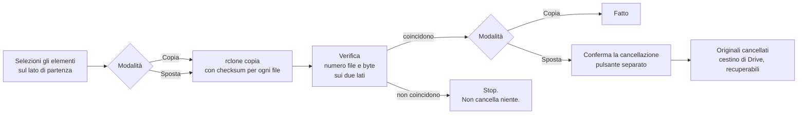

<div align="center">


# DriveFerry

**Sposta cartelle da un account Google Drive a un altro, vedendo cosa succede.**
Un'app desktop nativa costruita su rclone, per l'unica cosa che Google Drive ancora non fa.

[](https://github.com/rlpb/driveferry/actions/workflows/ci.yml)
[](https://github.com/rlpb/driveferry/releases/latest)
[](LICENSE)
[](pyproject.toml)

[Scarica](#scarica) · [Come funziona](#come-funziona-un-trasferimento) · [Sicurezza](#sicurezza-dei-dati) · [Domande](#domande-frequenti) · [English](README.md)

</div>

---

## Il problema

Google Drive non ha un comando "sposta questa cartella sull'altro mio account".
Puoi condividere una cartella e, in certi casi, trasferirne la proprietà, ma non
esiste un'azione unica che sposti un intero albero da un account Google a un
altro. Fra due account Gmail personali il trasferimento di proprietà di una
cartella non porta con sé i file che contiene. Fra organizzazioni Workspace
diverse è spesso bloccato del tutto.

Le alternative abituali sono scaricare tutto e ricaricarlo, oppure imparare la
riga di comando di rclone.

DriveFerry è la terza strada: vedi i due account affiancati, selezioni cosa
spostare e premi un pulsante.

<div align="center">

</div>

## Cosa fa

- **Due account affiancati.** Sfogli entrambi i Drive insieme, entri nelle
  cartelle, selezioni più elementi, trascini da un lato all'altro.
- **Copia che puoi guardare.** Avanzamento, velocità e stima del tempo residuo
  presi dalle statistiche di rclone.
- **Spostamento che non può mangiarti i dati.** Lo spostamento è in tre passi:
  copia, verifica che ogni file sia arrivato, e solo dopo cancella gli
  originali, con una conferma separata che devi premere tu.
- **Verifica prima della cancellazione.** Numero di file e byte totali
  confrontati sui due lati. Se non coincidono, la cancellazione non viene
  offerta.
- **Simulazione.** Chiedi a rclone cosa trasferirebbe, senza scrivere niente.
- **Copia lato server.** Quando Google la consente fra i tuoi due account, i
  byte non passano dal tuo computer né dalla tua connessione.
- **Una finestra vera.** Senza cornice, con la barra del titolo disegnata
  dall'app, uguale su Windows, macOS e Linux.
- **Tema chiaro e scuro.** Segue il sistema oppure lo fissi nelle impostazioni.
- **Italiano e inglese.** Segue il sistema oppure lo fissi nelle impostazioni.
- **Qualsiasi remote di rclone, non solo Drive.** Dropbox, OneDrive, S3, una
  cartella locale: se rclone ci parla, i due pannelli lo mostrano.

<div align="center">

</div>

## Scarica

Prendi il file per il tuo sistema dalla
[release più recente](https://github.com/rlpb/driveferry/releases/latest):

| Sistema | File | Note |
| --- | --- | --- |
| Windows 10/11 | `DriveFerry-windows-x64.exe` | Usa il runtime WebView2, già presente su Windows 11 |
| macOS, Apple Silicon | `DriveFerry-macos-arm64.zip` | Non firmata: al primo avvio tasto destro e **Apri** |
| macOS, Intel | `DriveFerry-macos-x64.zip` | Stesso primo avvio |
| Linux x64 | `DriveFerry-linux-x64` | Richiede `gir1.2-webkit2-4.0` e `python3-gi` |

Serve rclone sulla macchina. Se manca, l'app te lo dice e ti dà il comando:

| Sistema | Comando |
| --- | --- |
| Windows | `winget install --id Rclone.Rclone` |
| macOS | `brew install rclone` |
| Linux | `sudo -v ; curl https://rclone.org/install.sh \| sudo bash` |

### Oppure dal sorgente

```bash
git clone https://github.com/rlpb/driveferry
cd driveferry
python -m venv .venv && .venv\Scripts\activate
pip install -e .
python -m driveferry
```

Su Windows c'è anche `start.cmd`: doppio clic e il primo avvio prepara tutto da
solo.

## Collega gli account

Ogni account Google diventa un *remote* di rclone. Si fa una volta per account,
da terminale:

```bash
rclone config
```

Poi rispondi:

1. `n` per un nuovo remote
2. un nome corto che riconosci, per esempio `Personale` o `VecchioAccount`
3. scegli `drive` dall'elenco dei tipi di archiviazione
4. lascia vuoti `client_id` e `client_secret`, Invio due volte
5. scegli scope `1` (accesso completo)
6. lascia vuoti cartella radice e service account
7. `n` alla configurazione avanzata
8. `y` per usare il browser: si apre, scegli l'account Google, autorizza
9. `n` per Shared Drive, a meno che l'account ne usi uno
10. `y` per confermare, poi `q` per uscire

Ripeti per il secondo account. Verifica con:

```bash
rclone lsd Personale:
```

Apri DriveFerry e trovi entrambi gli account nei selettori.

> Il client OAuth condiviso che rclone usa per impostazione predefinita ha un
> limite di richieste valido per tutti gli utenti rclone del mondo. Per una
> migrazione singola va benissimo. Per una libreria grande conviene creare un
> client ID tuo: sono dieci minuti, la guida di rclone è su
> [rclone.org/drive/#making-your-own-client-id](https://rclone.org/drive/#making-your-own-client-id).

## Come funziona un trasferimento



Sotto il cofano DriveFerry avvia un job rclone per ogni elemento selezionato,
sotto un gruppo di statistiche condiviso: `sync/copy` per una cartella,
`operations/copyfile` per un singolo file. L'avanzamento arriva da
`core/stats`, l'esito di ogni job da `job/status`, la verifica da
`operations/size` sui due lati.

## Sicurezza dei dati

Una regola sola: **non si cancella niente che non sia stato prima verificato**,
e mai senza che tu prema un secondo pulsante.

- La copia è la modalità predefinita e non tocca mai l'origine.
- Lo spostamento non usa mai il `move` di rclone. Copia, verifica e chiede.
- Il passo di cancellazione viene rifiutato dal backend se la richiesta non
  porta un valore di conferma esplicito, che l'interfaccia invia solo dopo una
  verifica riuscita.
- Gli elementi cancellati finiscono nel cestino di Google Drive, dove restano
  30 giorni.
- La simulazione è a un interruttore di distanza, in qualsiasi momento.
- I percorsi che contengono `..` vengono rifiutati e i nomi dei remote sono
  confrontati con quelli che hai davvero configurato.

## Copia lato server

Con l'interruttore **Lato server** attivo, DriveFerry chiede a rclone
`--server-side-across-configs`. Quando Google accetta, la copia avviene dentro
l'infrastruttura di Google: niente download, niente upload, la tua velocità di
connessione smette di contare.

Non viene accettata sempre. Google la concede quando l'account di destinazione
può già leggere il file di origine: in pratica quando la cartella di origine è
condivisa con l'account di destinazione, oppure quando i due account
appartengono alla stessa organizzazione Workspace. Se Google rifiuta, rclone
ripiega su un trasferimento normale attraverso il tuo computer e il
trasferimento va comunque a buon fine. Il riepilogo mostra cosa è successo
davvero.

Fra due account Gmail personali scollegati, aspettati il ripiego. Condividere
prima la cartella di origine con l'account di destinazione rende la copia lato
server molto più probabile.

## Cosa DriveFerry non è

- Non è uno strumento di sincronizzazione: niente mirroring continuo, niente
  gestione dei conflitti.
- Non tocca la proprietà dei file. La copia appartiene all'account di
  destinazione, che di solito è esattamente quello che serve quando stai
  lasciando un account.
- Non è un prodotto di backup: sposta quello che selezioni, quando lo chiedi.

## Domande frequenti

**Che fine fanno Documenti, Fogli e Presentazioni Google?**
Non sono file veri dentro Drive, quindi non si possono copiare byte per byte.
rclone li esporta, per impostazione predefinita in formati Microsoft Office, e
la copia è un file normale. Se ti servono nativi, usa la condivisione e il
trasferimento di proprietà di Drive per quelli e DriveFerry per tutto il resto.

**Le scorciatoie sopravvivono?**
No. Una scorciatoia di Drive è un puntatore e non ha senso in un altro account.
rclone le salta.

**E i file condivisi con me che non sono miei?**
DriveFerry mostra quello che mostra rclone, cioè il tuo Drive. Gli elementi
condivisi con te stanno in un'area separata: copiali prima nel tuo Drive, poi
spostali.

**Rischio di sbattere contro i limiti di Google?**
Google consente circa 750 GB di caricamento al giorno per account. rclone si
ferma con un errore di quota quando li raggiungi e il trasferimento si può
ripetere il giorno dopo: gli elementi già trasferiti vengono saltati, quindi non
si riparte mai da zero.

**Funziona con Google Workspace?**
Sì, e anche con gli Shared Drive, se configuri il remote per usarli durante
`rclone config`. Alcune organizzazioni bloccano la copia fra organizzazioni a
livello di criterio: è una restrizione di Google e nessuno strumento la aggira.

**C'entra la mia password Google?**
Mai. L'autenticazione è quella di rclone via browser con Google. DriveFerry non
vede nessuna password e non legge i token che rclone salva.

**Posso usarlo per Dropbox o OneDrive?**
Sì. Qualsiasi remote configurato in rclone compare in entrambi i selettori.

## Sicurezza tecnica

L'app avvia un piccolo server HTTP su `127.0.0.1` e pilota un daemon rclone
locale. Entrambi sono chiusi: credenziali generate a ogni avvio, token di
sessione, controllo dell'header `Host` contro il DNS rebinding, nessun CORS,
Content-Security-Policy stretta e un'API che espone esattamente dieci operazioni
con argomenti validati.

I dettagli, modello di minaccia compreso, sono in [SECURITY.md](SECURITY.md).

## Com'è fatto

```
driveferry/
├── rclone.py    trova il binario, gestisce il processo rcd, parla l'API rc
├── server.py    l'API HTTP locale, le sue guardie e le dieci operazioni
├── app.py       avvio, finestra senza cornice, ponte per i pulsanti finestra
└── web/         l'interfaccia: nessun framework, nessuna build, nessun bundler
tests/
├── test_api.py             cosa DriveFerry chiede a rclone
├── test_server_security.py ogni rifiuto del server
├── test_paths.py           validazione dei percorsi al confine
└── test_end_to_end.py      rclone vero, file veri, copiati e verificati
```

## Sviluppo

```bash
pip install -e ".[dev]"
python -m pytest
ruff check . && ruff format --check .
python -m driveferry --browser --verbose
```

La CI esegue la suite su Linux, macOS e Windows, installa rclone su ogni runner
e fallisce se i test end-to-end si auto-saltano.

## Crediti

DriveFerry è una faccia per [rclone](https://rclone.org), che fa la parte
difficile: OAuth, trasferimenti riprendibili, checksum, tentativi ripetuti e
copia lato server. Se questo strumento ti è utile, il progetto da ringraziare e
sostenere è rclone.

## Licenza

MIT. Vedi [LICENSE](LICENSE).
