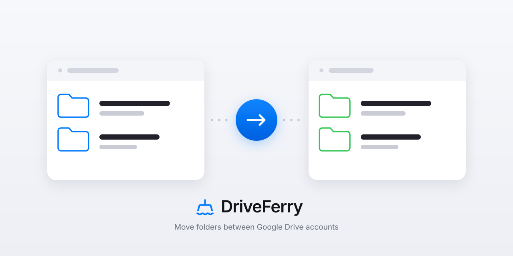
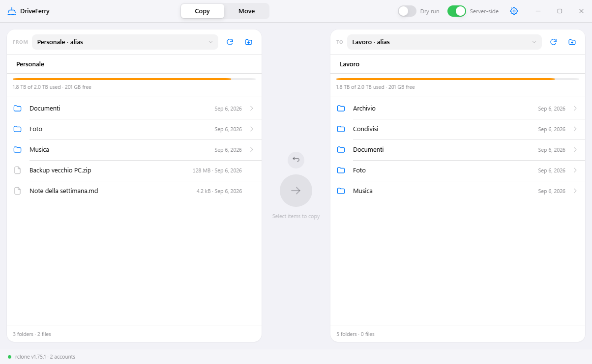
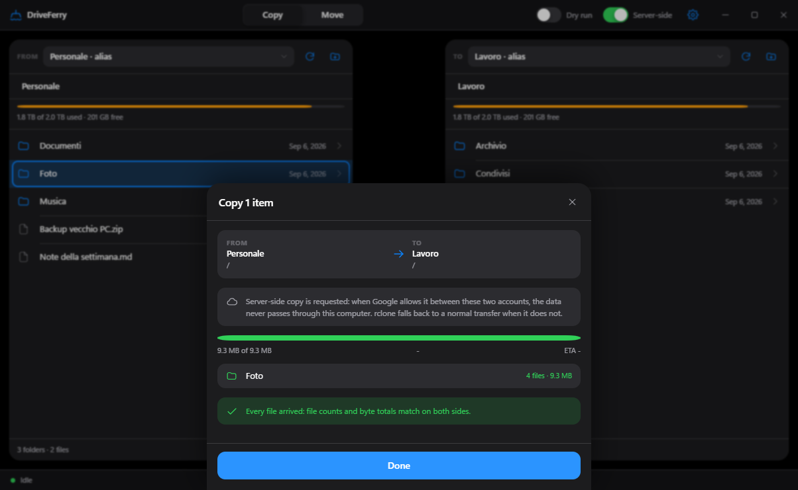
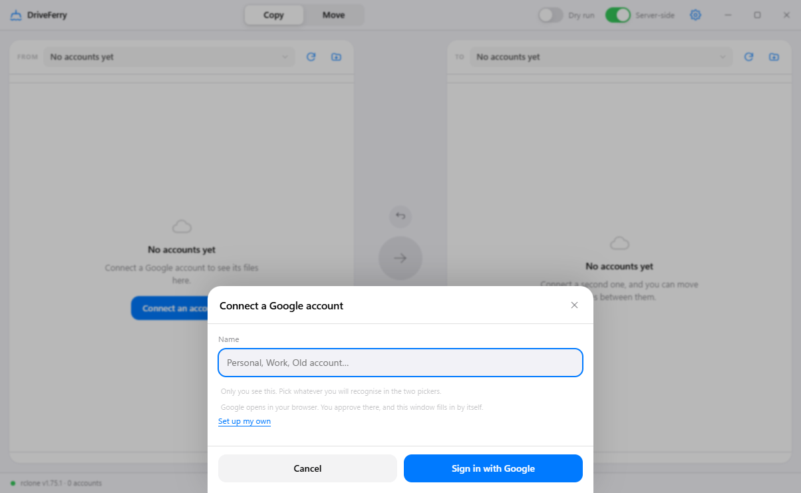
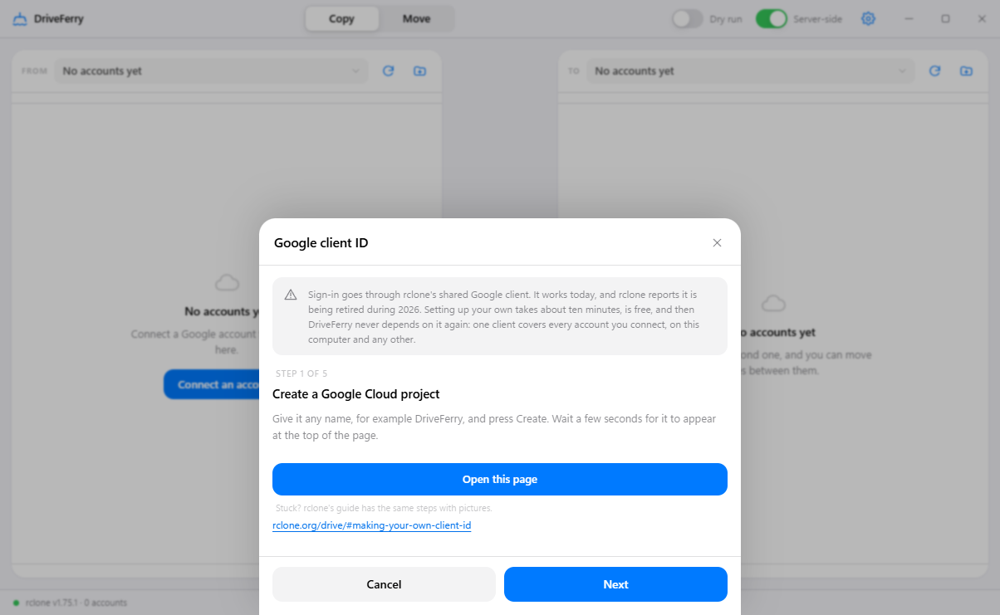
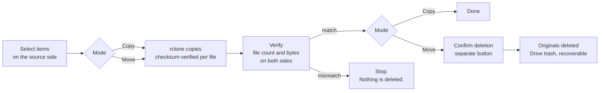

<div align="center">



# DriveFerry

**Move files and folders between Google Drive accounts, visually.**
A native desktop app on top of rclone, for the one thing Google Drive still cannot do.

[](https://github.com/rlpb/driveferry/actions/workflows/ci.yml)
[](https://github.com/rlpb/driveferry/releases/latest)
[](LICENSE)
[](pyproject.toml)
[](#download)

[Download](#download) · [How it works](#how-a-transfer-works) · [Safety](#safety) · [FAQ](#faq) · [Italiano](README.it.md)

</div>

---

## The problem

Google Drive has no "move this folder to my other account". You can share a
folder, and you can transfer ownership one file at a time in some cases, but
there is no single action that moves a whole tree from one Google account to
another. Between two personal Gmail accounts, ownership transfer of a folder
does not carry the files inside it. Between different Workspace organisations,
it is often blocked outright.

The usual workarounds are download-everything-and-upload-it-again, or learning
rclone's command line.

DriveFerry is the third option: you see both accounts side by side, you select
what to move, and you press one button.

<div align="center">

</div>

## Features

- **Connect accounts without a terminal.** A wizard walks you through it and
  hands the sign-in to Google's own page. Your password is never typed into
  DriveFerry.
- **Two accounts, side by side.** Browse both Drives at once, navigate folders,
  select several items, drag from one side to the other.
- **Copy that you can watch.** Live progress, speed and ETA, straight from
  rclone's own statistics.
- **Move that cannot eat your data.** Move is three steps: copy, verify that
  every file arrived, and only then delete the originals, on a separate
  confirmation you have to press yourself.
- **Verification before deletion.** File count and byte total are compared on
  both sides. A mismatch cancels the delete step.
- **Dry run.** Ask rclone what it would transfer, and write nothing.
- **Server-side copy.** When Google allows it between your two accounts, the
  bytes never touch your computer or your connection.
- **A real window.** Frameless, with a title bar the app draws itself, so it
  looks the same on Windows, macOS and Linux.
- **Light and dark.** Follows the system, or pin one in Settings.
- **English and Italian.** Follows the system, or pin one in Settings.
- **Any rclone remote, not just Drive.** Dropbox, OneDrive, S3, a local folder:
  if rclone can talk to it, both panes can show it.

<div align="center">

</div>

## Download

Grab the build for your system from the
[latest release](https://github.com/rlpb/driveferry/releases/latest):

| System | File | Notes |
| --- | --- | --- |
| Windows 10/11 | `DriveFerry-windows-x64.exe` | Uses the WebView2 runtime, already present on Windows 11 |
| macOS, Apple Silicon | `DriveFerry-macos-arm64.zip` | Unsigned: first launch is right-click then **Open** |
| Linux x64 | `DriveFerry-linux-x64` | Needs `gir1.2-webkit2-4.0` and `python3-gi` installed |
| Intel Mac | run from source | GitHub retired its Intel build runners; the source install below works |

DriveFerry needs rclone on the machine. If it is missing, the app says so and
gives you the command:

| Platform | Command |
| --- | --- |
| Windows | `winget install --id Rclone.Rclone` |
| macOS | `brew install rclone` |
| Linux | `sudo -v ; curl https://rclone.org/install.sh \| sudo bash` |

### Or run it from source

```bash
git clone https://github.com/rlpb/driveferry
cd driveferry
python -m venv .venv && . .venv/bin/activate   # Windows: .venv\Scripts\activate
pip install -e .
python -m driveferry
```

There is also `start.cmd` on Windows and `start.sh` elsewhere: double-click it
and the first run sets everything up.

## Connect your accounts

Press **Connect an account**, give it a name you will recognise, and press
**Sign in with Google**. Google's own consent page opens in your browser, you
allow access, and the app fills in by itself. Repeat for the second account.

Your password is never typed into DriveFerry. The page that asks for it is
Google's.

<div align="center">

</div>

<details>
<summary>Using your own Google client ID</summary>

Sign-in goes through rclone's shared Google client, which every rclone user in
the world shares. Two reasons to swap in your own, from **Use my own Google
client ID** in the wizard:

- large migrations can hit Google's rate limit on the shared client
- rclone reports that this shared client is being retired during 2026

It is free and takes about ten minutes, and the app walks you through it:
five steps, each with the button that opens exactly the Google page that step
is about. Settings, then **Google client ID**.

<div align="center">

</div>

Set it up once and every account you connect from then on uses it, on this
computer and any other.

</details>

> Prefer the terminal, or connecting something other than Drive? `rclone config`
> still works, and every remote it creates shows up in DriveFerry.

## How a transfer works



Underneath, DriveFerry starts one rclone job per selected item, under a shared
statistics group: `sync/copy` for a folder, `operations/copyfile` for a single
file. Progress is read from `core/stats`, per-job outcome from `job/status`, and
verification from `operations/size` on both sides.

## Safety

The tool was built with one rule: **nothing gets deleted that has not been
verified first**, and never without you pressing a second button.

- Copy is the default mode. It never touches the source.
- Move never calls rclone's `move`. It copies, verifies, and asks.
- The delete step is refused by the backend unless the request carries an
  explicit confirmation value. The UI only sends it after verification passed.
- Deleted items go to Google Drive's trash, where they stay for 30 days.
- Dry run is one switch away, at any time.
- Paths containing `..` are rejected, and remote names are checked against the
  ones you actually configured.

## Server-side copy

With the **Server-side** switch on, DriveFerry asks rclone for
`--server-side-across-configs`. When Google accepts it, the copy happens inside
Google's infrastructure: nothing is downloaded, nothing is uploaded, and your
connection speed stops mattering.

It is not always accepted. Google grants it when the destination account can
already read the source file, which in practice means the source folder is
shared with the destination account, or both accounts belong to the same
Workspace organisation. When Google refuses, rclone falls back to a normal
transfer through your machine and the transfer still completes. The transfer
summary shows what actually happened.

Between two unrelated personal Gmail accounts, expect the fallback. Sharing the
source folder with the destination account first makes server-side copy far more
likely.

## What DriveFerry is not

- It is not a sync tool. There is no continuous mirroring and no conflict
  resolution.
- It does not touch file ownership. A copy is owned by the destination account,
  which is usually what you want when leaving an account behind.
- It is not a backup product. It moves what you select, when you ask.

## FAQ

**What happens to Google Docs, Sheets and Slides?**
They are not real files in Drive, so they cannot be copied byte for byte.
rclone exports them, by default to Microsoft Office formats, and the copy is a
regular file. If you need them to stay native Google documents, use Drive's own
sharing and ownership transfer for those, and DriveFerry for everything else.

**Do shortcuts survive?**
No. A Drive shortcut is a pointer, and it is not meaningful in another account.
rclone skips them by default.

**What about files shared with me that I do not own?**
DriveFerry shows what rclone shows, which is your own Drive. Items shared with
you live in a separate area. Copy them into your Drive first, then move them.

**Will I hit Google's limits?**
Google allows around 750 GB of upload per account per day. rclone stops with a
quota error when you reach it, and the transfer can be repeated the next day.
Items already transferred are skipped, so you never restart from zero.

**Does it work with Google Workspace?**
Yes. Shared Drives work too, if you configure the remote for them during
`rclone config`. Some organisations block cross-organisation copying at the
policy level; that restriction is Google's, and no tool works around it.

**Is my Google password involved?**
Never. Authentication is rclone's browser flow with Google. DriveFerry never
sees a password, and never reads the tokens rclone stores.

**Can I use it for Dropbox or OneDrive?**
Yes. Any remote you configure in rclone shows up in both pickers.

## Security

The app runs a small HTTP server on `127.0.0.1` and drives a local rclone
daemon. Both are locked down: per-run credentials, a session token, a loopback
`Host` check against DNS rebinding, no CORS, a strict Content-Security-Policy,
and an API that exposes exactly ten operations with validated arguments.

The details, including the threat model and what is deliberately out of scope,
are in [SECURITY.md](SECURITY.md).

## How it is built

```
driveferry/
├── rclone.py    finds the binary, owns the rcd process, speaks the rc API
├── server.py    the local HTTP API, its guards, and the ten operations
├── app.py       startup, the frameless window, the window-control bridge
└── web/         the interface: no framework, no build step, no bundler
tests/
├── test_api.py             what DriveFerry asks rclone to do
├── test_server_security.py every refusal the server makes
├── test_paths.py           path validation at the boundary
└── test_end_to_end.py      a real rclone, real files, copied and verified
```

The Python side is the standard library plus pywebview. The interface is plain
HTML, CSS and JavaScript: no framework and no build step, so what you read is
what runs.

## Development

```bash
pip install -e ".[dev]"
python -m pytest          # unit tests plus real-rclone end-to-end tests
ruff check . && ruff format --check .
python -m driveferry --browser --verbose
```

CI runs the suite on Linux, macOS and Windows, installs rclone on every runner,
and fails if the end-to-end tests skip themselves.

See [CONTRIBUTING.md](CONTRIBUTING.md) before opening a pull request.

## Support

DriveFerry carries none of your bytes. [rclone](https://rclone.org/donate/)
does, and it is the project to support first.

If this tool saved you an afternoon and you want to say thanks anyway, there is
a [Ko-fi](https://ko-fi.com/rlpb_). Nothing here is paywalled, and nothing ever
will be.

## Credits

DriveFerry is a face for [rclone](https://rclone.org), which does the hard part:
OAuth, resumable transfers, checksums, retries and server-side copy. If this
tool is useful to you, [support rclone](https://rclone.org/donate/) first. It
carries every byte you move.

## License

Apache 2.0. See [LICENSE](LICENSE) and [NOTICE](NOTICE).

You can use, change and redistribute DriveFerry, including commercially.
What the licence asks in return is that the copyright notice, the licence
and the NOTICE file travel with it, and that you say what you changed.

---

<div align="center">
<sub>Keywords: move files between Google Drive accounts · transfer Google Drive to another account ·
migrate Google Drive · Google Drive migration tool · rclone GUI · gdrive transfer</sub>
</div>
